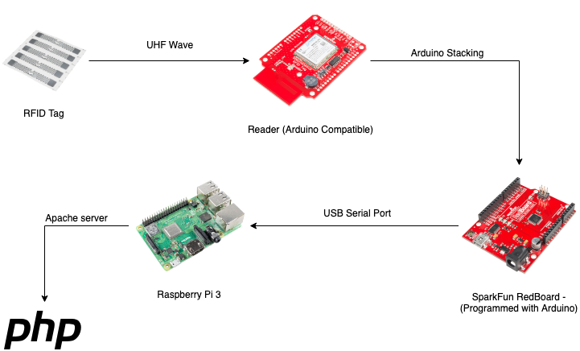

# RFID_Warehouse

A simple project aiming at simulating a **RFID enabled warehouse**. A RFID reader connected to an Arduino card scans tags and sends information about the scanned products to a Raspberry Pi. The list of scanned products is rendered using a dynamic PHP webpage.

## Interface displaying scanned products

## Architecture

## Technologies

Arduino : C

Raspberry Pi : Python3, serial module to communicate with the Arduino

Display : PHP, Apache
